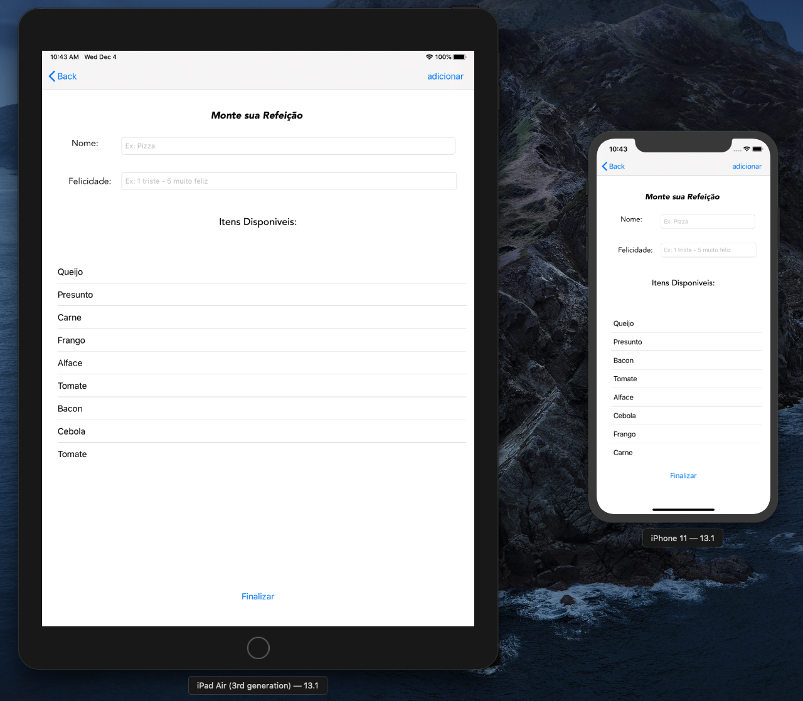
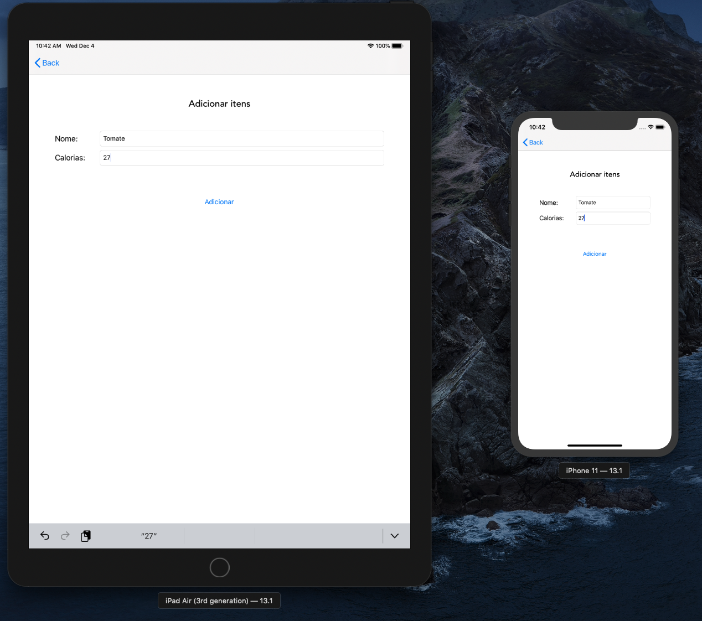
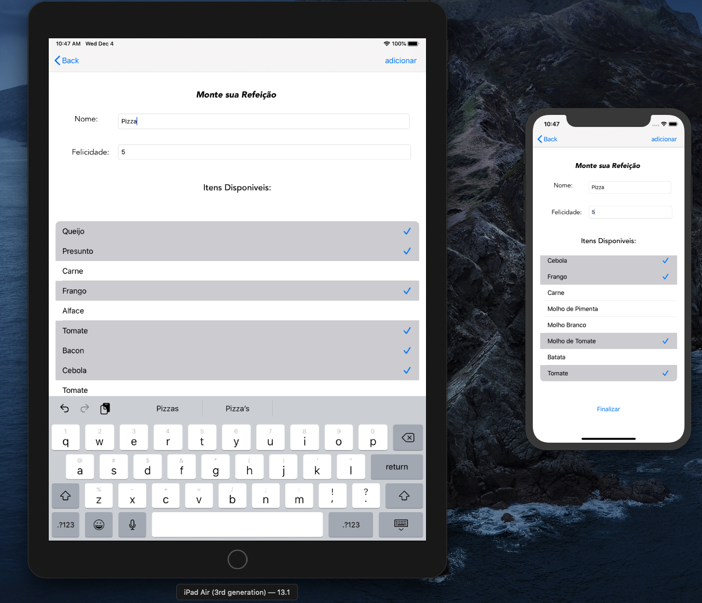
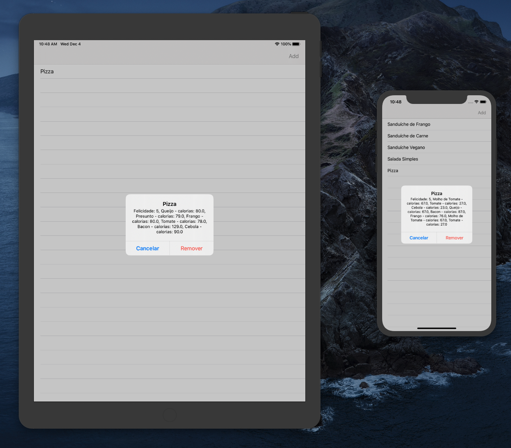

# Happy-Food

### - App Simples Desenvolvido em Swift com intuito de por em prática alguns conhecimentos adquirido estudando a linguagem.

## Funções presentes no App:

O Happy food é um aplicativo simples, somente com intuito de cadastrar uma refeição com itens nessa refeição e o nivel de felicidade que ela te traz, esses itens podem ser adicionados no app também (com nome e calorias), no final o app mostra todas as refeições cadastradas, e atraves de um long press(clique mais longo) em uma refeição o app exibe a felicidade que a refeição te causa juntamente com os itens nela e as calorias dos mesmos.

# Capturas de Tela da Aplicação

## Tela Inicial

## Tela de Adicionar Itens

## Criando Refeição

## Tela de Lista de Refeições Criadas

